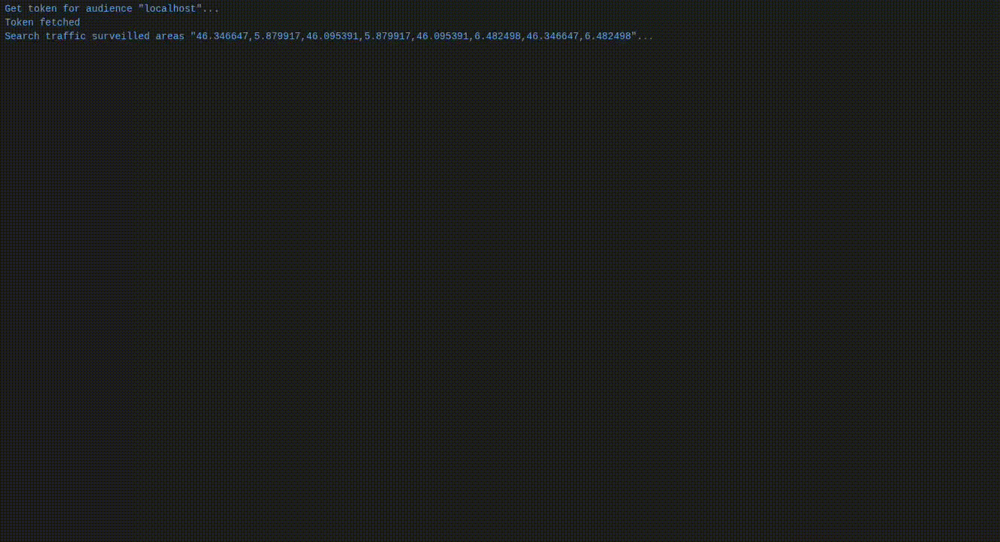

# cis-examples

## surveillance: 

### description

In this example, we call the surveillance search Traffic Surveilled Area from the dss,
gather the uss base urls and then query each of them to retrieve the stream of flights, and print every event.



### usage:

go build -o surveillance ./cmd/surveillance

then run it with the rights flags
```
  -dss-base-path string
        surveillance service base path for the dss (default "/surveillance/v0")
  -dss-url string
        base url of the dss, expect protocol to be part of it
  -oidc-client-id string
        oidc client id
  -oidc-client-secret string
        oidc client secret
  -oidc-scopes string
        scopes to pass to oidc, default to surveillance.display_provider, optional (default "surveillance.display_provider")
  -oidc-token-url string
        url of the authentication server, token endpoint expected, protocol expected
  -view string
        lat1,lng1,lat2,lng2 each as float
```

./surveillance
