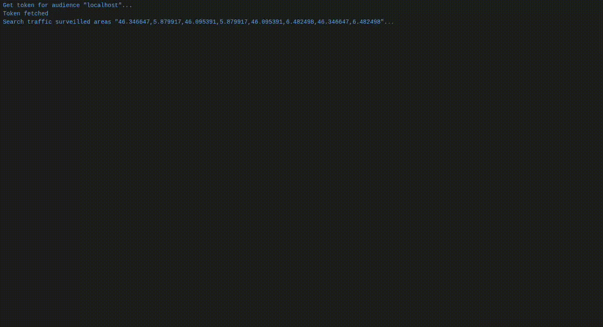

# cis-examples

This project is a collection of examples for the u-space data provisionng and exchange between the CIS and USS.

## Authentication

This project uses OAuth 2.0 with the Client Credentials Grant flow for authentication.
To interact with the examples, you must provide a valid Client ID and Client Secret issued by the OpenID Connect (OIDC) provider.

Required parameters:

```
  -oidc-client-id string
        oidc client id
  -oidc-client-secret string
        oidc client secret
  -oidc-token-url string
        url of the authentication server, token endpoint expected, protocol expected
```

## Geo-Awareness

### Description

This example demonstrates how to discover and ingest active ED-318 geozones within a specific geographic area.
The client queries the DSS for active constraints referneces, fetches the corresponding constraints details from 
their managers and prints the embeded ED-318 geozone.

### Usage

Run `go run ./cmd/geoawareness` with
```
  -dss-url string
        base url of the dss, expect protocol to be part of it
  -view string
        lat1,lng1,lat2,lng2 each as float
```

## DAR

### Description

This example runs the full DAR lifecycle through the DAR Coordinator sandbox:
publish a DAR, query its ED-318 constraint, report it vacated, then deactivate
it.

### Usage

Run `go run ./cmd/dar` with:

```
  -dar-coordinator-url string
        DAR Coordinator base URL
  -dar-id string
        DAR identifier
  -dar-vacated-oidc-scope string
        OIDC scope for the DAR Coordinator sandbox and VACATED callback (default "utm.dar_vacated")
  -dss-url string
        DSS base URL
  -end-time string
        DAR end time in RFC3339 format
  -start-time string
        DAR start time in RFC3339 format
  -view string
        DAR area as lat1,lng1,lat2,lng2
```

## Surveillance

### Description

This example demonstrates how to discover and stream real-time ATM data within a specific geographic area.
The client queries the DSS for active Traffic Surveilled Areas (TSA), and consumes the Server-Sent Event (SSE) flight streams
from individual surveillance providers.



### Usage

Run `go run ./surveillance` with
```
  -dss-url string
        base url of the dss, expect protocol to be part of it
  -view string
        lat1,lng1,lat2,lng2 each as float
```
